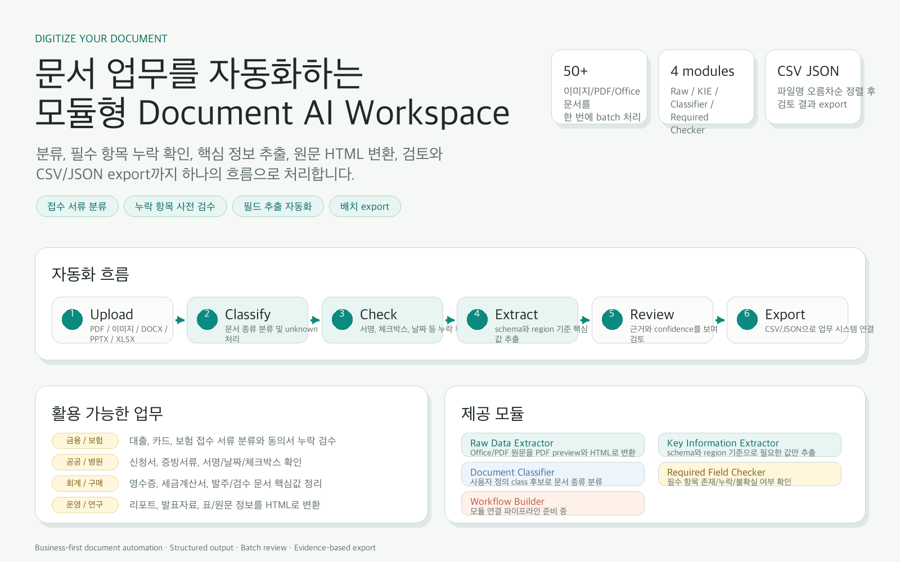
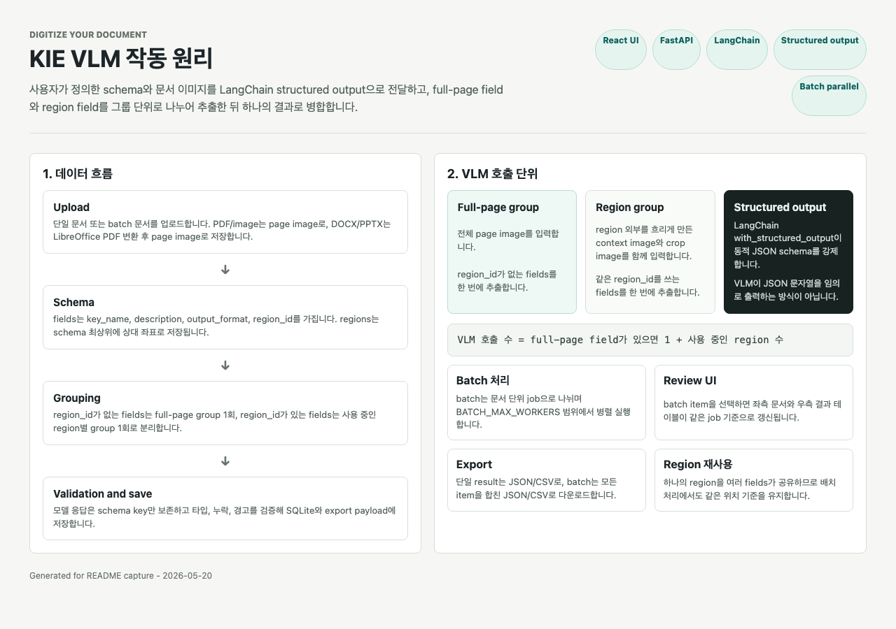

<div align="center">
  <h1>Digitize Your Document</h1>
  <p><b>반복적인 문서 접수, 분류, 누락 검수, 핵심 정보 추출, 결과 정리를 한 화면에서 자동화합니다.</b></p>
  <p>
    <code>문서 접수 자동화</code>
    <code>필수 항목 누락 검수</code>
    <code>문서 종류 분류</code>
    <code>핵심 정보 추출</code>
    <code>배치 CSV/JSON export</code>
  </p>
</div>



## 어디에 활용할 수 있나

대량 문서를 사람이 열어 보고, 어떤 문서인지 나누고, 비어 있는 항목을 확인하고, 필요한 값을 엑셀로 옮기는 업무에 바로 적용할 수 있습니다.

| 활용 영역 | 자동화할 수 있는 일 | 기대 효과 |
| --- | --- | --- |
| 금융/보험 접수 | 신청서, 동의서, 신분/소득 증빙 분류와 필수 서명/체크박스 누락 확인 | 접수 반려와 재요청 시간을 줄입니다. |
| 공공/병원/교육 서류 | 신청서 유형 분류, 작성일/성명/서명/첨부 여부 확인 | 담당자 검수 대기열을 빠르게 정리합니다. |
| 회계/구매/정산 | 영수증, 세금계산서, 발주서, 검수 문서의 핵심값 추출 | 수기 입력과 파일명별 취합 작업을 줄입니다. |
| 운영/연구 문서 | PDF, PPTX, DOCX, XLSX 원문을 HTML로 변환하고 필요한 표/문장을 확인 | 검색 가능한 내부 자료화와 검토 속도를 높입니다. |
| 대량 백오피스 처리 | 50장 이상 파일을 한 번에 업로드하고 결과를 검수/export | 반복 클릭과 엑셀 정리 시간을 줄입니다. |

## 업무 자동화 범위

Digitize Your Document를 사용하면 대량 문서에서 수작업으로 값을 확인하던 업무를 몇 분 단위의 자동 처리로 바꿀 수 있습니다.

| 자동화 대상 | 처리 방식 | 결과 |
| --- | --- | --- |
| 대량 이미지/PDF에서 특정 값 추출 | 사용자 schema + 선택 region + VLM structured output | 파일명 기준 정렬 CSV/JSON |
| 문서 종류 분류 | 사용자가 정의한 class 후보 + unknown 허용 | 파일별 class, confidence, evidence |
| 필수 항목 누락 확인 | checklist + evidence type + optional region | complete/incomplete/needs_review |
| DOCX/PPTX/PDF 원문 확인 | LibreOffice/PyMuPDF preview + Python parser | PDF preview + HTML 원문 |
| 50장 이상 반복 검토 | Batch sidebar + progress polling + result review | 항목별 검토와 batch export |
| 손글씨/복잡한 레이아웃 보조 | full page context + masked page + enlarged crop | region 기반 집중 추출 |

## 2026-05-21 변경 사항

- README 상단 이미지를 최신 모듈 구조와 비즈니스 활용 중심으로 교체했습니다.
- GitHub에 올라가는 문서를 `README.md`, `DEVELOPMENT_DEFINITION.md`, `ERROR_NOTE.md` 중심으로 정리했습니다. 로컬 이해용 HTML과 디자인 기록은 저장소에 올리지 않습니다.
- `.gitignore`를 default-deny 방식으로 바꿨습니다. 모든 파일을 먼저 무시하고, 제품 실행에 필요한 source/config/docs/assets만 `!` allowlist로 추적합니다.
- 표로 표현 가능한 설정/결과 UI는 KIE field table 스타일로 통일합니다. Document Classifier의 class 후보, Required Field Checker의 checklist item, 결과/review table도 같은 문법을 따릅니다.
- `Schema Library`와 모듈별 library는 overlay가 아니라 작업 화면을 밀어내는 push sidebar 방향으로 정리했습니다. 문서 preview와 field table을 계속 조작할 수 있는 작업형 UX를 우선합니다.
- `Document Classifier`와 `Required Field Checker` 모듈을 추가했습니다. 두 모듈 모두 VLM structured output 기반이며 단일/배치 실행, 결과 검수, CSV/JSON export를 지원합니다.
- Home 기능 카드를 `Raw Data Extractor`, `Key Information Extractor`, `Document Classifier`, `Required Field Checker`, `Workflow Builder`로 재정리했습니다. OCR/Intelligence Parse 예정 카드는 제거했습니다.
- Schema version 개념을 제거했습니다. 같은 이름의 schema는 하나의 현재 내용만 가지며, 수정하면 새 버전이 아니라 기존 schema가 갱신됩니다.
- KIE 단일 문서 화면에서 저장된 schema를 `Schema Library`의 카드형 리스트로 선택하고, 필드/설명/region 수정 내용은 자동 저장됩니다.
- Schema 추가, 선택, 이름 변경, 설명, 삭제, 템플릿, JSON import/export, region 관리는 `Schema Library` drawer로 분리하고, 메인 화면은 field table 중심으로 정리했습니다.
- Schema description 옆의 `AI 수정` 버튼은 문서 이미지를 요구하지 않고 현재 field list만 보고 schema-level 설명을 다시 생성합니다.
- Setting 창에 파싱 기록 삭제 버튼을 추가했습니다. 저장된 schema는 유지하고 문서, batch, 추출 결과, raw extraction 기록만 비울 수 있습니다.
- Batch 파일은 업로드 직후부터 이미지명 오름차순으로 정렬해 sidebar에 표시합니다.
- Batch CSV/JSON export도 이미지명 오름차순으로 정렬해 내려받습니다.
- VLM runtime 설정에 `reasoning_effort`, `verbosity`, `max_completion_tokens`, `top_p`, `service_tier`를 추가했습니다. Thinking 계열 모델도 기본값 `reasoning_effort=minimal`, `verbosity=low`로 빠른 추출을 우선합니다.
- Batch progress polling은 active batch를 1초 간격으로 직접 조회하고, API cache를 끄도록 보강했습니다.
- SQLite는 WAL과 busy timeout을 적용해 batch worker와 polling read가 겹칠 때의 잠금 대기를 줄였습니다.
- README와 개발정의서를 “업무 자동화 가치 → 기술 세부사항” 흐름으로 재정리했습니다.

## 기능

| 기능 | 상태 | 설명 |
| --- | --- | --- |
| Raw Data Extractor | 구현 | `.docx`, `.xlsx`, `.pptx`, `.pdf`를 업로드하면 PDF preview와 HTML 정보 추출 결과를 생성합니다. |
| Key Information Extractor | 구현 | PDF/image/DOCX/PPTX 문서를 업로드하고 사용자가 정의한 schema 기준으로 VLM structured output 값을 추출합니다. |
| Document Classifier | 구현 | 사용자가 직접 정의한 후보 class와 unknown 허용 규칙으로 문서를 분류합니다. |
| Required Field Checker | 구현 | 값 추출보다 단순하게 필수 항목의 존재/누락/불확실 여부만 확인합니다. |
| Workflow Builder | 예정 | 여러 모듈을 드래그 앤 드롭으로 연결하는 파이프라인 빌더입니다. |

## 기술 구성

| 영역 | 도구 |
| --- | --- |
| Frontend | React 19, Vite 7, TypeScript, lucide-react |
| Backend API | FastAPI, Uvicorn, Pydantic Settings |
| Database | SQLite, SQLAlchemy |
| VLM | LangChain, langchain-openai, google-genai, structured output |
| PDF/Image | PyMuPDF |
| Office Preview | LibreOffice `soffice` CLI |
| DOCX Parsing | mammoth, OOXML fallback |
| XLSX Parsing | openpyxl |
| PPTX Parsing | python-pptx, OOXML fallback |
| HTML Safety | bleach sanitize, sandboxed iframe |
| Dev/Test | uv, pytest, npm, Vite build |

## 실행

Python은 conda가 아니라 `uv` 기반 `.venv`를 사용합니다.

```bash
uv venv --python 3.11 .venv
uv pip install -e 'backend[dev]'
```

Frontend 의존성을 설치합니다.

```bash
cd frontend
npm ci
cd ..
```

Backend와 frontend를 한 번에 실행합니다.

```bash
./scripts/run_dev.sh
```

기본 주소:

| 서버 | 주소 | 개발 반영 |
| --- | --- | --- |
| Backend | `http://127.0.0.1:8000` | `backend/app` 변경 시 `uvicorn --reload` |
| Frontend | `http://127.0.0.1:5173` | Vite dev server |

`scripts/run_dev.sh`의 backend reload 감시 범위는 `.venv`, local DB, storage output 변경으로 extraction 작업이 재시작되지 않도록 `backend/app`으로 제한합니다.
`run_dev.sh`는 실행 전에 backend 핵심 의존성(`pymupdf`, `bleach`, `google-genai`)과 frontend 핵심 패키지 파일을 점검합니다. `node_modules`가 없거나 불완전하면 lockfile 기준 `npm ci`로 복구합니다.

## 설정

Home 화면 우측 상단 `Setting` 버튼에서 API key, model name, LibreOffice path, VLM runtime parameter를 저장합니다. Save를 누르면 프로젝트 root의 `.env`가 자동 생성 또는 갱신됩니다.

주요 값:

```env
APP_ENV=local
DATABASE_URL=sqlite:///backend/kie.db
DOCUMENT_STORAGE_DIR=backend/storage/documents
VLM_PROVIDER=auto
VLM_API_KEY=
VLM_MODEL_NAME=
VLM_BASE_URL=
VLM_TEMPERATURE=0
VLM_MAX_RETRIES=2
VLM_TIMEOUT_SECONDS=120
VLM_REASONING_EFFORT=minimal
VLM_VERBOSITY=low
VLM_MAX_COMPLETION_TOKENS=
VLM_TOP_P=
VLM_SERVICE_TIER=
BATCH_MAX_WORKERS=8
LIBREOFFICE_PATH=/Applications/LibreOffice.app/Contents/MacOS/soffice
```

`VLM_PROVIDER=auto`에서는 별도 provider 선택 없이 호출 방식을 자동 결정합니다.

| 입력 | 내부 호출 방식 |
| --- | --- |
| `VLM_BASE_URL` 있음 | OpenAI-compatible endpoint |
| `VLM_API_KEY`가 `AIza`로 시작하고 `VLM_BASE_URL` 없음 | Google GenAI native Gemini |
| 그 외 API key | OpenAI-compatible endpoint |
| `VLM_PROVIDER=mock` | 로컬 mock |

`VLM_API_KEY`와 `VLM_MODEL_NAME`이 있으면 이 값이 우선 사용됩니다. `OPENAI_API_KEY`, `OPENAI_MODEL_NAME`은 하위 호환 alias이며 `VLM_*`가 비어 있을 때만 fallback으로 사용합니다.

예시:

```env
# Gemini native
VLM_PROVIDER=auto
VLM_API_KEY=AIza...
VLM_MODEL_NAME=gemini-3.1-flash-lite
VLM_BASE_URL=
```

```env
# OpenAI-compatible gateway
VLM_PROVIDER=auto
VLM_API_KEY=...
VLM_MODEL_NAME=google/gemini-3.1-flash-lite
VLM_BASE_URL=https://openrouter.ai/api/v1
```

Thinking 모델을 빠르게 쓰고 싶다면 기본값을 유지합니다.

```env
VLM_REASONING_EFFORT=minimal
VLM_VERBOSITY=low
```

모델/provider가 해당 parameter를 지원하지 않으면 값을 비워서 비활성화할 수 있습니다.

로컬 데모에서 실제 VLM 호출을 피하려면 root `.env`에 아래 값을 둘 수 있습니다.

```env
VLM_PROVIDER=mock
```

## LibreOffice

LibreOffice는 Python 패키지가 아니라 OS 레벨 앱/CLI입니다. Office 문서의 PDF preview 생성을 위해 backend가 외부 `soffice` 명령을 호출합니다.

macOS 설치:

```bash
brew install --cask libreoffice
soffice --version
```

자동 탐색이 되지 않으면 Home 설정 또는 `.env`에서 경로를 지정합니다.

```env
LIBREOFFICE_PATH=/Applications/LibreOffice.app/Contents/MacOS/soffice
```

## Raw Data Extractor

지원 포맷:

| 포맷 | PDF preview | HTML 추출 |
| --- | --- | --- |
| `.docx` | LibreOffice 변환 | mammoth + OOXML fallback |
| `.xlsx` | LibreOffice 변환 | openpyxl sheet table |
| `.pptx` | LibreOffice 변환 | python-pptx slide text/table/image |
| `.pdf` | 원본 복사 | PyMuPDF page text/image |

처리 흐름:

1. 원본 문서를 업로드합니다.
2. Backend가 `backend/storage/raw/{id}/original.ext`에 저장합니다.
3. Backend가 `preview.pdf`를 생성합니다.
4. Backend가 `content.html`을 생성합니다.
5. UI 좌측은 PDF preview, 우측은 HTML preview를 표시합니다.

업로드 옵션:

| 옵션 | 기본값 | 설명 |
| --- | --- | --- |
| `include_images` | on | 지원 가능한 embedded raster image를 HTML에 data URL로 포함합니다. |
| `include_formulas` | off | XLSX formula와 DOCX/PPTX Office Math 텍스트를 포함합니다. |

Raw API:

| Method | Path |
| --- | --- |
| `POST` | `/api/raw-extractions` |
| `GET` | `/api/raw-extractions?limit=20` |
| `GET` | `/api/raw-extractions/{id}` |
| `GET` | `/api/raw-extractions/{id}/pdf` |
| `GET` | `/api/raw-extractions/{id}/html` |

## Key Information Extractor

지원 입력:

| 포맷 | 처리 |
| --- | --- |
| `.pdf` | page image로 rasterize 후 VLM에 전달 |
| `.png`, `.jpg`, `.jpeg` | 1페이지 문서로 저장 후 VLM에 전달 |
| `.docx`, `.pptx` | LibreOffice로 PDF 변환 후 page image로 rasterize |

스키마 필드:

| 필드 | 설명 |
| --- | --- |
| `key_name` | 추출할 값의 키 이름 |
| `description` | 문서 내 위치, 의미, 추출 기준 |
| `output_format` | `string`, `float`, `date`, `bool` |
| `region_id` | 선택 항목. schema-level region을 참조하는 ID |

`regions`는 schema 최상위에 저장됩니다. 각 region은 `id`, `name`, `page`, `x`, `y`, `width`, `height`로 구성하며 `x/y/width/height`는 0~1 사이 상대 좌표입니다. 여러 field가 같은 `region_id`를 참조할 수 있고, `region_id`가 없는 field는 전체 문서에서 추출합니다. Batch extraction은 저장된 schema의 현재 내용을 사용하므로 region template도 함께 재사용됩니다.

Region field는 VLM 입력 시 두 이미지를 함께 사용합니다. 하나는 region 외부를 흐리게 만든 원본 page context이고, 다른 하나는 실제 판독용 crop입니다. 따라서 description에 “우측 하단” 같은 위치 표현이 있어도 원본 page 위치 맥락과 crop 집중도를 함께 제공합니다.

KIE 추출은 group 단위로 나뉩니다. `region_id`가 없는 field들은 full-page group 1회로 추출하고, `region_id`가 있는 field들은 사용 중인 region별로 묶어 각각 추출합니다. 따라서 호출 수는 `full-page field가 있으면 1회 + 사용 중인 region 수`입니다.



KIE 결과 확인 후 다른 문서를 다시 로드하려면 좌측 Document toolbar의 `Replace`를 사용합니다. 현재 schema는 유지하고 문서/결과만 교체됩니다. `Clear`는 현재 문서와 결과를 비우고 업로드 화면으로 돌아갑니다.

Batch extraction:

- KIE 메인 업로드 화면에서 저장된 schema 하나를 선택하고 여러 파일 또는 폴더를 업로드해 같은 기준으로 KIE 추출을 실행합니다.
- 업로드된 파일은 이미지명 기준 오름차순으로 정렬되어 batch sidebar에 표시됩니다.
- Batch 실행 후 좌측 문서 영역의 batch file sidebar에서 각 파일을 이동할 수 있습니다. 선택한 파일의 문서 preview와 추출 결과가 같은 화면에서 갱신됩니다.
- Batch 내부 파일들은 `BATCH_MAX_WORKERS` 개수까지 병렬로 VLM extraction을 실행합니다.
- Batch worker는 VLM 호출 중 DB connection을 들고 있지 않으며, document/schema 준비와 결과 저장 시점에만 짧게 DB session을 사용합니다.
- Batch sidebar 또는 batch 결과 목록에서 `CSV` 또는 `JSON`을 눌러 batch 전체 결과를 즉시 다운로드할 수 있습니다. Export row도 이미지명 기준 오름차순으로 정렬됩니다.
- Running/queued batch는 `Stop`으로 중단 요청할 수 있습니다. 이미 VLM 호출 중인 파일은 현재 호출이 끝난 뒤 취소 상태로 정리됩니다.

KIE API:

| Method | Path |
| --- | --- |
| `GET` | `/api/health` |
| `GET` | `/api/system/status` |
| `GET` | `/api/settings/vlm` |
| `PUT` | `/api/settings/vlm` |
| `POST` | `/api/documents` |
| `GET` | `/api/documents?limit=20` |
| `POST` | `/api/schemas` |
| `GET` | `/api/schemas` |
| `PATCH` | `/api/schemas/{schema_id}` |
| `POST` | `/api/schemas/recommendations` |
| `POST` | `/api/extraction-jobs` |
| `GET` | `/api/extraction-jobs/{job_id}` |
| `PATCH` | `/api/extraction-results/{result_id}` |
| `GET` | `/api/extraction-results/{result_id}/export?format=json\|csv` |
| `POST` | `/api/batches` |
| `GET` | `/api/batches?limit=20` |
| `POST` | `/api/batches/{batch_id}/cancel` |
| `GET` | `/api/batches/{batch_id}/export?format=csv\|json` |

## Document Classifier

문서가 계약서, 신청서, 동의서, 증빙서류 등 어떤 종류인지 빠르게 나누는 모듈입니다. 사용자가 class 후보를 직접 정의하고, 후보에 맞지 않으면 `unknown`으로 남길 수 있습니다. 대량 문서가 섞여 들어오는 업무에서 먼저 분류한 뒤 KIE나 필수 항목 확인으로 넘기는 전처리 단계로 쓸 수 있습니다.

설정 구조:

| 필드 | 설명 |
| --- | --- |
| `name` | classifier 설정 이름 |
| `description` | 분류 목적과 적용 문서 범위 |
| `allow_unknown` | 후보 class에 맞지 않는 문서를 unknown으로 허용 |
| `classes` | `class_name`, `description`, `signals` 목록 |

결과:

| 값 | 설명 |
| --- | --- |
| `status` | `classified`, `unknown`, `needs_review` |
| `class_name` | 선택된 class 이름 |
| `confidence` | 0~1 confidence |
| `reason` | 판단 이유 |
| `evidence` | 문서에서 본 근거 |

API:

| Method | Path |
| --- | --- |
| `POST/GET/PATCH/DELETE` | `/api/document-classifiers` |
| `POST` | `/api/classification-jobs` |
| `GET` | `/api/classification-jobs/{job_id}` |
| `PATCH` | `/api/classification-results/{result_id}` |
| `POST` | `/api/classification-batches` |
| `GET` | `/api/classification-batches?limit=20` |
| `POST` | `/api/classification-batches/{batch_id}/cancel` |
| `GET` | `/api/classification-batches/{batch_id}/export?format=csv\|json` |

## Required Field Checker

KIE처럼 값을 추출하지 않고, 필수 항목이 문서에 존재하는지만 확인하는 모듈입니다. 예를 들어 성명, 날짜, 서명, 체크박스, 도장 등이 비어 있는지 빠르게 거를 수 있습니다. 값의 정확성이나 외부 DB 일치 여부는 확인하지 않습니다.

설정 구조:

| 필드 | 설명 |
| --- | --- |
| `name` | checklist 설정 이름 |
| `description` | 확인 목적 |
| `regions` | optional 상대좌표 region 목록 |
| `items` | `item_name`, `description`, `evidence_type`, `required`, optional `region_id` |

`evidence_type`:

- `text_or_handwriting`
- `checkbox`
- `signature_or_stamp`
- `visual_mark`
- `other`

결과:

| 값 | 설명 |
| --- | --- |
| `overall_status` | `complete`, `incomplete`, `needs_review` |
| item `status` | `present`, `missing`, `uncertain`, `not_applicable` |
| `evidence` | 존재/누락 판단 근거 |
| `page` | 근거 page |

API:

| Method | Path |
| --- | --- |
| `POST/GET/PATCH/DELETE` | `/api/required-field-checklists` |
| `POST` | `/api/required-field-check-jobs` |
| `GET` | `/api/required-field-check-jobs/{job_id}` |
| `PATCH` | `/api/required-field-check-results/{result_id}` |
| `POST` | `/api/required-field-check-batches` |
| `GET` | `/api/required-field-check-batches?limit=20` |
| `POST` | `/api/required-field-check-batches/{batch_id}/cancel` |
| `GET` | `/api/required-field-check-batches/{batch_id}/export?format=csv\|json` |

두 모듈 모두 KIE와 같은 문서 업로드/rasterize 구조를 사용합니다. PDF/image/DOCX/PPTX를 page image로 만든 뒤 VLM에 전달하고, batch에서는 파일명 기준 오름차순으로 처리/export합니다.

## 문서와 구조

| 파일 | 설명 |
| --- | --- |
| `DEVELOPMENT_DEFINITION.md` | 제품 기준 개발정의서 |
| `ERROR_NOTE.md` | 중요 오류와 수정 검증 기록 |
| `README.md` | GitHub 첫 화면에서 보는 제품 소개, 실행, 설정, API 요약 |
| `assets/readme_overview.png` | README 상단 제품 overview 이미지 |
| `assets/vlm_runtime_overview.png` | README에 포함되는 VLM 작동 원리 캡처 이미지 |
| `sync_raw_to_pdf.py` | LibreOffice PDF 변환 참고 스크립트 |

로컬 이해용 HTML, 디자인 메모, 샘플 파일은 Git에 올리지 않습니다. 저장소는 실행 가능한 제품 코드와 GitHub에서 읽을 문서만 추적합니다.

디렉터리:

```text
.
├── backend/                  # FastAPI, SQLite, 문서 처리, VLM, raw extraction
├── frontend/                 # Vite + React + TypeScript UI
├── scripts/run_dev.sh        # backend/frontend 동시 실행
├── DEVELOPMENT_DEFINITION.md
├── ERROR_NOTE.md
├── assets/
│   ├── readme_overview.png
│   └── vlm_runtime_overview.png
└── README.md
```

## 테스트

Backend:

```bash
.venv/bin/python -m pytest backend
```

Frontend:

```bash
cd frontend
npm run build
```

Backend 테스트는 Office 파일의 LibreOffice 변환을 mock 처리합니다. 실제 Office to PDF 변환은 로컬 smoke test로 확인합니다.

## 구조 변경 이력

GitHub에는 핵심 변경 이력만 문서화합니다. 로컬에서 만든 실험용 HTML 시각화 문서는 `.gitignore` 정책상 추적하지 않습니다.

| 날짜 | 구조 | 내용 |
| --- | --- | --- |
| 2026-05-21 | KIE MVP | 전체 page image와 schema fields를 한 번에 VLM structured output으로 추출했습니다. |
| 2026-05-21 | Field-owned region | 각 field가 optional `region` 좌표를 직접 소유하고, region field에 crop image를 추가했습니다. |
| 2026-05-21 | Schema-level region | `schema.regions`를 최상위에 두고 여러 field가 같은 `region_id`를 참조하도록 바꿨습니다. |
| 2026-05-21 | Masked context | region crop과 함께 region 외부를 흐리게 만든 원본 page context를 VLM 입력에 추가했습니다. |
| 2026-05-21 | Grouped extraction | `region_id` 없는 field는 full-page group 1회, region field는 사용 중인 region별 1회로 분리 호출하고 결과를 merge합니다. |
| 2026-05-21 | Module workspace | Document Classifier와 Required Field Checker를 추가하고, 향후 Workflow Builder를 위해 config/run/result/review/export 패턴을 맞췄습니다. |
| 2026-05-21 | Table-first UX | 설정과 결과를 표 중심으로 통일하고, 라이브러리는 작업 화면을 밀어내는 sidebar로 정리했습니다. |
| 2026-05-21 | Repository hygiene | `.gitignore`를 default-deny allowlist 방식으로 바꾸고, 로컬 HTML/디자인 메모/sample은 Git에서 제외했습니다. |

현재 KIE 호출 수는 `full-page field가 있으면 1회 + 사용 중인 region 수`입니다.

## 운영 메모

- SQLite DB 기본 파일명은 `backend/digitize_documents.db`입니다.
- 업로드 문서와 raw extraction 결과는 `backend/storage/` 아래에 저장됩니다.
- `.env`, `.venv`, local DB, storage output, `node_modules`, frontend build artifact는 git에서 제외됩니다.
- `.gitignore`는 모든 파일을 먼저 무시한 뒤 필요한 source, test, 실행 스크립트, GitHub 문서, README asset만 allowlist로 포함합니다.
- `.env.example` 복사는 필요하지 않습니다. Home Setting에서 `.env`를 생성합니다.
