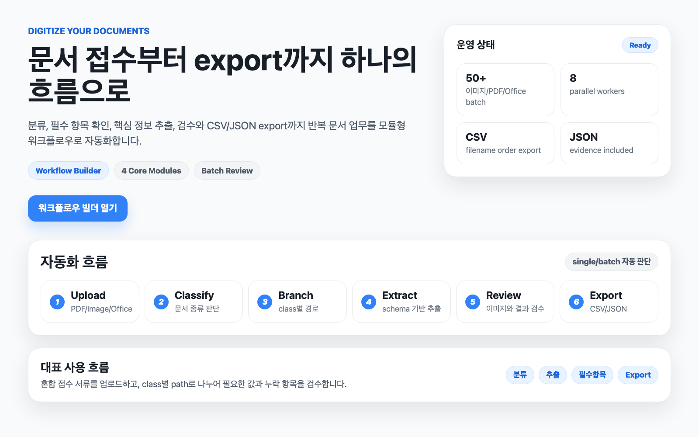
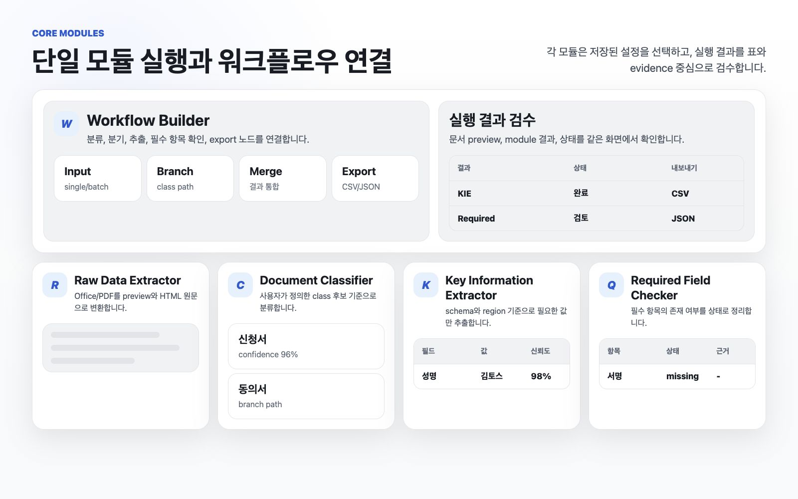
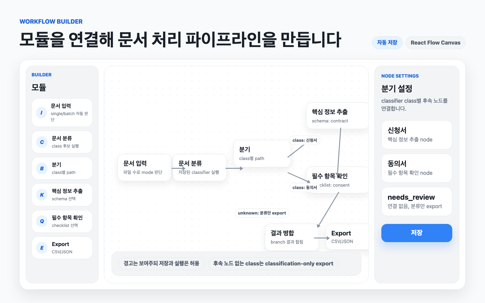
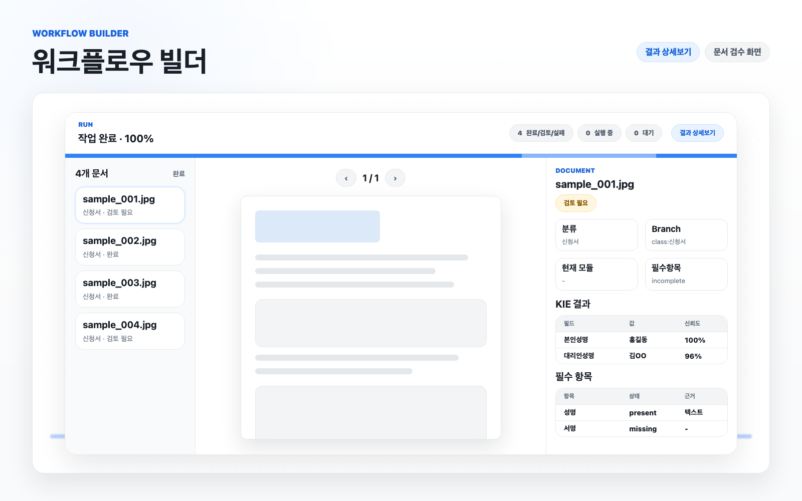

<div align="center">
  <h1>Document Automation Workspace</h1>
  <p><b>수작업으로 반복하던 문서 분류, 필수 항목 확인, 핵심 정보 추출, 결과 정리를 하나의 자동화 흐름으로 연결하는 문서 업무 자동화 앱입니다.</b></p>
  <p>
    <code>Workflow Builder</code>
    <code>Document Library</code>
    <code>Document Classifier</code>
    <code>Required Field Checker</code>
    <code>Key Information Extractor</code>
    <code>Raw Data Extractor</code>
  </p>
</div>



## Demo

외부 데모는 production과 같은 단일 서버 구성을 띄운 뒤 ngrok HTTPS URL로 확인합니다.

```bash
ACCESS_CODE=<shared-code> ./scripts/start_hosting_demo.sh
```

고정 ngrok domain을 사용할 때:

```bash
NGROK_URL=https://your-domain.ngrok.app ACCESS_CODE=<shared-code> ./scripts/start_hosting_demo.sh
```

## Features



| Module | Purpose |
| --- | --- |
| Document Library | 파일/폴더를 먼저 보관함에 올리고, 백그라운드 변환 후 모든 모듈과 워크플로우에서 재사용합니다. |
| Workflow Builder | 문서 입력, 분류, 분기, 추출, 필수 항목 확인, 병합, export 노드를 연결합니다. |
| Document Classifier | 사용자가 정의한 class 후보와 `unknown` 기준으로 문서를 분류합니다. |
| Required Field Checker | 성명, 날짜, 서명, 체크박스 등 필수 항목의 존재 여부를 확인합니다. |
| Key Information Extractor | 저장된 schema 기준으로 field, value, confidence, evidence를 추출합니다. |
| Raw Data Extractor | PDF, Office 문서, 이미지의 preview와 원문 데이터를 생성합니다. |

## Document Library

- 홈의 `문서 보관함`에서 파일 또는 폴더를 계속 추가할 수 있습니다.
- 업로드 대기열은 현재 업로드가 진행 중이어도 다음 파일/폴더를 받아 순서대로 처리합니다.
- 보관함은 원본 파일, 상대 경로, 변환 상태, page image/meta를 관리합니다.
- `ready` 문서는 즉시 실행되고, `queued`/`preprocessing` 문서는 “준비되면 실행” 상태로 모듈/워크플로우 작업에 연결됩니다.
- 문서 삭제는 원본과 page image payload만 삭제하고, 과거 결과 row와 실행 기록은 보존합니다.

## Workflow Builder





- React Flow 캔버스에서 문서 처리 모듈을 연결합니다.
- `업로드`로 새 문서를 보관함에 추가하거나, `문서 보관함`에서 기존 문서를 선택해 실행합니다.
- 새 업로드는 먼저 보관함에 저장되고, workflow run은 보관함 document id를 참조합니다.
- 보관함 문서를 선택하면 업로드를 반복하지 않고 같은 원본 payload를 재사용합니다.
- 새로고침이나 네트워크 끊김 후에는 `이어가기`로 같은 원본을 다시 선택해 남은 항목만 업로드할 수 있습니다.
- 실행 중에는 `계속 처리`, `일시중단`, `이어가기`, `재시작`, `대기열 추가`, `중단·정리`로 상태를 제어합니다.
- `대기열 추가`는 업로드된 원본 문서를 복사하지 않고 다음 workflow run을 `waiting` 상태로 등록하며, 앞선 run이 끝나면 자동으로 시작합니다.
- 진행 상태는 `업로드됨`, `전처리`, `실행 중`, `대기`, `완료/검토/실패` counter로 분리해 표시합니다.
- 결과 화면은 문서 목록 스크롤 위치를 유지하고, 상세 결과에서 문서 이미지와 module output을 함께 검수합니다.
- 결과 CSV/JSON에는 문서별 `upload_duration_ms`, `inference_duration_ms`가 포함됩니다.

## Common Ingestion Pipeline

신규 UX의 기본 입력 경로는 문서 보관함입니다. 기존 `init -> items -> start` multipart API는 호환성과 업로드 이어가기를 위해 유지합니다.

| Step | Description |
| --- | --- |
| `library upload` | `/api/library/uploads`가 원본 파일을 저장하고 document conversion job을 등록합니다. |
| `conversion` | 백그라운드 worker가 PDF/page image/meta를 만들고 document를 `ready`로 바꿉니다. |
| `from-documents` | 모듈/워크플로우는 `document_ids`만 받아 batch/run item을 만듭니다. |
| `ready dispatch` | 이미 ready인 문서는 즉시 실행하고, 변환 중인 문서는 준비 후 자동 실행합니다. |
| `summary` | polling은 summary endpoint로 counter만 가져오고, 상세 화면에서만 item page를 조회합니다. |

공통 상태는 `uploading`, `preprocessing`, `waiting`, `running`, `paused`, `completed`, `needs_review`, `completed_with_errors`, `failed`, `canceled`를 사용합니다.

## Recovery Controls

| Control | Behavior |
| --- | --- |
| `중단·정리` | 실행 기록은 남기고 업로드 파일, preview, 중간 결과 산출물을 정리합니다. |
| `계속 처리` | 업로드가 끝났지만 아직 실행되지 않은 run/batch를 시작합니다. |
| `이어가기` | 새로고침 등으로 끊긴 업로드에서 같은 원본을 재선택해 누락 파일만 등록합니다. |
| `일시중단` | 업로드된 문서는 보존하고, 새 item 실행을 멈춥니다. 진행 중인 VLM 호출은 현재 item까지만 마무리합니다. |
| `재시작` | 업로드된 원본은 유지하고 기존 추론 결과와 문서별 추론 시간을 초기화한 뒤 처음부터 다시 추론합니다. |
| `대기열 추가` | 업로드된 원본은 공유하고 새 workflow snapshot을 `waiting` run으로 추가합니다. 이전 run이 `completed`, `needs_review`, `completed_with_errors`가 되면 다음 대기 run을 자동 시작합니다. |
| `대기 취소` | 아직 시작하지 않은 `waiting` run만 취소하며 공유 문서는 삭제하지 않습니다. |
| `실패 재시도` | 결과 상세 화면에서 실패한 문서만 다시 queue에 넣고, 성공한 문서는 그대로 보존합니다. |

## Input / Output

| Input | Handling |
| --- | --- |
| PDF | page image로 rasterize 후 preview와 VLM context에 사용 |
| PNG/JPG/JPEG | 원본은 그대로 보존하고 preview/VLM용 JPEG를 생성 |
| DOCX/PPTX | LibreOffice로 PDF 변환 후 처리 |
| XLSX | sheet HTML과 PDF preview 생성 |

| Output | Format |
| --- | --- |
| KIE | field, value, normalized value, confidence, evidence |
| Classification | class name, confidence, reason, evidence |
| Required Check | item별 present/missing/uncertain/not_applicable |
| Workflow Export | branch별 union-column CSV/JSON, upload/inference duration |

## API Shape

| Area | Endpoint |
| --- | --- |
| System status | `GET /api/system/status` |
| Document library | `POST /api/library/uploads`, `GET /api/documents`, `GET /api/library/tree`, `DELETE /api/documents/{document_id}` |
| Workflow from library | `POST /api/workflows/{workflow_id}/runs/from-documents` |
| Workflow upload legacy | `POST /api/workflows/{workflow_id}/runs/init`, `POST /api/workflow-runs/{run_id}/items`, `POST /api/workflow-runs/{run_id}/start` |
| Workflow recovery | `POST /api/workflow-runs/{run_id}/discard`, `POST /api/workflow-runs/{run_id}/resume`, `POST /api/workflow-runs/{run_id}/pause`, `POST /api/workflow-runs/{run_id}/restart`, `POST /api/workflow-runs/{run_id}/retry-failed` |
| Workflow queue | `POST /api/workflow-runs/{run_id}/enqueue`, `POST /api/workflow-runs/{run_id}/cancel-waiting`, `POST /api/workflow-runs/{run_id}/start` |
| KIE from library | `POST /api/batches/from-documents` |
| Classification from library | `POST /api/classification-batches/from-documents` |
| Required check from library | `POST /api/required-field-check-batches/from-documents` |
| Legacy batch upload | `POST /api/batches/init`, `POST /api/batches/{batch_id}/items`, `POST /api/batches/{batch_id}/start` |
| Summary polling | `GET /api/workflow-runs/{run_id}/summary`, `GET /api/batches/{batch_id}/summary` 계열 |

기존 단일 `/api/documents` multipart API는 호환성용으로 즉시 전처리 완료 계약을 유지합니다. 보관함 대량 업로드 API가 백그라운드 conversion queue를 사용합니다.

## Stack

| Layer | Tech |
| --- | --- |
| Frontend | Vite, React, TypeScript, React Flow |
| Backend | FastAPI, SQLAlchemy, Alembic-compatible lightweight migration |
| Storage | Local filesystem, S3-compatible adapter 준비 |
| Document Preview | PyMuPDF, LibreOffice headless |
| VLM | Gemini/OpenAI-compatible/mock provider |

## Local Run

```bash
uv venv --python 3.11 .venv
uv pip install -e 'backend[dev]'

cd frontend
npm ci
cd ..

./scripts/run_dev.sh
```

| Server | URL |
| --- | --- |
| Frontend | `http://127.0.0.1:5173` |
| Backend | `http://127.0.0.1:8000` |

Mock VLM으로 UI와 workflow만 확인할 때:

```env
VLM_PROVIDER=mock
VLM_MODEL_NAME=mock-vlm
```

## Key Environment Variables

| Env | Default | Description |
| --- | --- | --- |
| `UPLOAD_CHUNK_FILES` | `10` | frontend가 system status에서 읽는 chunk 파일 수 |
| `PREPROCESS_MAX_WORKERS` | `2` | 문서 전처리 동시성 |
| `WORKFLOW_MAX_WORKERS` | `16` | 문서별 workflow local 작업 동시성 |
| `DOCUMENT_PAGE_MAX_LONG_EDGE` | `3000` | preview/VLM용 JPEG 긴 변 제한 |
| `DOCUMENT_PAGE_JPEG_QUALITY` | `88` | preview/VLM용 JPEG 품질 |
| `VLM_MAX_CONCURRENT_REQUESTS` | `128` | provider로 나가는 AI 동시 요청 수 |
| `DATABASE_POOL_SIZE` | `64` | SQLAlchemy DB connection pool 크기 |
| `DATABASE_MAX_OVERFLOW` | `0` | pool 크기를 넘는 임시 connection 허용 수 |
| `DATABASE_POOL_TIMEOUT_SECONDS` | `60` | DB connection 대기 timeout |
| `UPLOAD_MAX_BATCH_FILES` | `10000` | 한 번에 업로드할 수 있는 batch 파일 수 |
| `UPLOAD_RETENTION_HOURS` | `24` | 업로드 문서 보존 시간 |

운영에서 5,000장 이상 대량 처리를 자주 실행한다면 SQLite보다 Postgres 사용을 권장합니다.

## Production Hosting

기본 배포 방식은 frontend 정적 호스팅과 backend API 분리 배포입니다. 단일 서버 fallback도 지원합니다.

| Env | Description |
| --- | --- |
| `APP_ENV=production` | production mode |
| `ACCESS_CONTROL_MODE=shared_secret` | 공유 접근 코드 기반 접근 제어 |
| `APP_ACCESS_SECRET` | 외부 접근 코드 |
| `SESSION_SECRET_KEY` | HttpOnly session cookie 서명 키 |
| `CORS_ALLOWED_ORIGINS` | frontend origin allowlist |
| `DATABASE_URL` | SQLite 또는 Postgres URL |
| `STORAGE_BACKEND=local` | local persistent volume 저장 |
| `SERVE_FRONTEND=true` | FastAPI가 `frontend/dist`를 직접 서빙 |

```bash
cd frontend
npm run build

APP_ENV=production \
ACCESS_CONTROL_MODE=shared_secret \
APP_ACCESS_SECRET=<shared-code> \
SESSION_SECRET_KEY=<session-secret> \
DATABASE_URL=sqlite:////data/document-automation.db \
DOCUMENT_STORAGE_DIR=/data/documents \
RAW_STORAGE_DIR=/data/raw \
PROCESSING_TMP_DIR=/data/processing \
UPLOAD_RETENTION_HOURS=24 \
SERVE_FRONTEND=true \
FRONTEND_DIST_DIR="$(pwd)/dist" \
../.venv/bin/python -m uvicorn app.main:app --app-dir ../backend --host 0.0.0.0 --port 8000
```

세부 배포 절차는 [docs/deployment.md](docs/deployment.md)에 정리되어 있습니다.

## README Media

README 이미지는 `assets/readme-src/*.html`에서 관리합니다. 워크플로우 빌더 이미지는 로컬 웹 UI를 직접 캡처한 화면을 사용하고, 나머지는 같은 스타일의 HTML artboard를 `assets/readme/*.png`로 렌더링합니다.

## Test

```bash
npm run build --prefix frontend
.venv/bin/python -m pytest backend -q
```

## Repository

```text
backend/      FastAPI API, document processing, workflow execution
frontend/     React application
scripts/      local run and hosting demo scripts
docs/         deployment notes and README media source
assets/       README images
```
