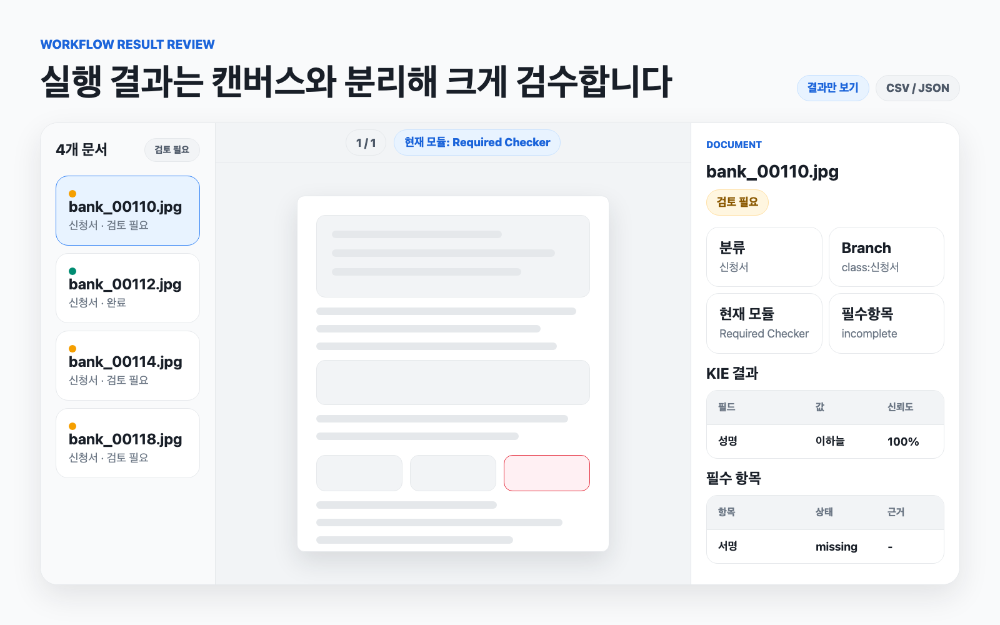
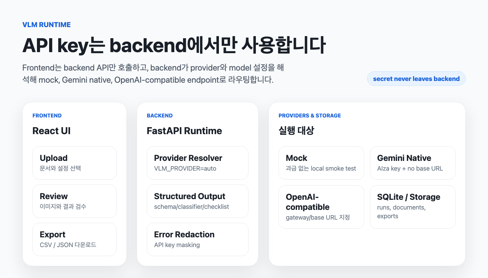

<div align="center">
  <h1>Document Automation Workspace</h1>
  <p><b>문서 접수, 분류, 필수 항목 검수, 핵심 정보 추출, 결과 export를 하나의 워크플로우로 자동화하는 로컬 문서 처리 앱입니다.</b></p>
  <p>
    <code>Workflow Builder</code>
    <code>Document Classifier</code>
    <code>Required Field Checker</code>
    <code>Key Information Extractor</code>
    <code>Batch Export</code>
  </p>
</div>


## 이게 뭔가요

`Document Automation Workspace`는 사람이 문서를 열어 보고, 종류를 나누고, 빠진 항목을 확인하고, 필요한 값을 엑셀로 옮기는 반복 업무를 줄이기 위한 React + FastAPI 기반 문서 자동화 워크스페이스입니다.

PDF, 이미지, DOCX, PPTX, XLSX 같은 업무 문서를 업로드하면 문서 preview를 만들고, 저장된 schema/classifier/checklist를 기준으로 VLM이 구조화된 결과를 생성합니다. 결과는 화면에서 검수한 뒤 CSV/JSON으로 내보낼 수 있습니다.

## 어떤 가치가 있나요

| 업무 상황 | 기존 방식 | 이 앱으로 바뀌는 방식 |
| --- | --- | --- |
| 여러 종류의 문서가 섞여 들어옴 | 담당자가 파일을 하나씩 열어 분류 | Document Classifier가 class를 먼저 판단하고 branch를 선택 |
| 신청서, 동의서, 서명 누락 검수 | 사람이 체크박스와 서명란을 확인 | Required Field Checker가 present/missing/uncertain으로 정리 |
| 문서에서 특정 값 취합 | 담당자가 엑셀에 복사 | KIE schema 기준으로 field/value/confidence/evidence 추출 |
| 여러 모듈을 매번 수동 실행 | 분류 후 다시 추출 화면으로 이동 | Workflow Builder에서 end-to-end pipeline 실행 |
| 대량 파일 처리 | 진행 상태를 알기 어렵고 결과 취합이 느림 | batch rail, 문서 preview, module별 inspector, union-column export 제공 |

## 할 수 있는 일


### Workflow Builder


- React Flow 캔버스에서 `Input`, `Document Classifier`, `Branch`, `KIE`, `Required Field Checker`, `Merge`, `Export` 노드를 연결합니다.
- 업로드 파일이 1개면 단일 실행, 2개 이상이면 batch 실행으로 자동 판단합니다.
- 저장된 classifier class에 따라 branch path를 나누고, class별로 다른 KIE schema나 required checklist를 실행할 수 있습니다.
- 후속 노드가 없는 class는 분류 결과까지만 export할 수 있습니다.
- 실행 중에는 문서 리스트, 선택 문서 이미지 preview, 현재 실행 node, module별 결과 table을 한 화면에서 봅니다.

### Workflow 실행 결과 검수



Workflow 실행 후에는 캔버스를 유지한 상태에서 진행률을 확인하고, 결과 상세 보기를 누르면 캔버스 위에 overlay 결과창이 뜹니다. 문서 리스트, 선택 문서 preview, 현재 실행 node, KIE 결과 table, 필수 항목 table을 한 화면에서 확인합니다.

### Document Classifier

- 문서 종류 후보 class를 직접 정의합니다.
- 후보에 맞지 않거나 판단이 불확실한 문서는 `unknown`으로 남깁니다.
- batch 실행과 CSV/JSON export를 지원합니다.

### Required Field Checker

- 성명, 날짜, 서명, 도장, 동의 체크박스처럼 “반드시 있어야 하는 항목”을 확인합니다.
- 값 자체를 추출하는 대신 항목별 `present`, `missing`, `uncertain`, `not_applicable` 상태를 만듭니다.
- 업로드 문서를 보고 AI가 checklist 초안을 추천할 수 있습니다.

### Key Information Extractor

- 저장된 schema 기준으로 문서에서 필요한 field만 추출합니다.
- field별 description, output format, optional region을 사용할 수 있습니다.
- region이 있는 field는 원본 page context와 crop을 함께 전달해 작은 영역의 판독 정확도를 높입니다.

### Raw Data Extractor

- DOCX, XLSX, PPTX, PDF를 PDF preview와 HTML 추출 결과로 변환합니다.
- Office 문서는 LibreOffice headless 변환을 사용합니다.
- 이미지와 수식 추출 옵션을 제공합니다.

## 화면 흐름

1. Home에서 단일 모듈 또는 Workflow Builder를 선택합니다.
2. Setting에서 VLM API key, model name, LibreOffice path를 저장합니다.
3. KIE schema, classifier, required checklist를 라이브러리에 저장합니다.
4. 단일 모듈로 바로 실행하거나, Workflow Builder에서 모듈을 연결합니다.
5. 문서를 업로드합니다. 파일 수에 따라 single/batch가 자동 결정됩니다.
6. 실행 결과를 preview와 table로 검수합니다.
7. CSV 또는 JSON으로 export합니다.

## 디자인 기준

Home과 Workflow Builder UI는 [Toss Design System Mobile](https://tossmini-docs.toss.im/tds-mobile/)과 [앱인토스 TDS 문서](https://developers-apps-in-toss.toss.im/design/components.html)를 벤치마크해 회색 기반 표면, 명확한 blue primary action, 리스트 단위의 정보 구조, 실행 결과 집중 화면을 중심으로 정리했습니다. 상세 기준은 [docs/toss-design-benchmark.md](docs/toss-design-benchmark.md)에 정리했습니다.

- [Colors](https://tossmini-docs.toss.im/tds-mobile/foundation/colors/)와 [Typography](https://tossmini-docs.toss.im/tds-mobile/foundation/typography/) 흐름을 참고해 배경은 차분하게, 실제 행동 버튼은 blue primary로 강조합니다.
- [Button](https://tossmini-docs.toss.im/tds-mobile/components/button/)의 `fill`/`weak` 위계를 참고해 실행 버튼은 blue fill, 저장/갱신/결과 보기 같은 보조 행동은 weak 톤으로 분리합니다.
- [ListRow](https://tossmini-docs.toss.im/tds-mobile/components/ListRow/list-row-overview/)의 left/content/right 구조를 참고해 Home 기능 카드와 Workflow 실행 문서 rail을 더 읽기 쉬운 정보 단위로 구성합니다.
- [Badge](https://tossmini-docs.toss.im/tds-mobile/components/badge/), [Progress Bar](https://tossmini-docs.toss.im/tds-mobile/components/progress-bar/), [Modal](https://tossmini-docs.toss.im/tds-mobile/components/modal/)의 역할을 참고해 상태 pill, 실행 progress, 결과 overlay를 구성합니다.

### 디자인 출처와 사용 범위

이 프로젝트는 Toss Design System의 공개 문서를 시각적 기준으로 참고한 자체 구현입니다. 공식 TDS UI Kit, 컴포넌트 패키지, 로고, 브랜드 자산, Figma 파일을 포함하거나 재배포하지 않습니다. 앱인토스 [피그마/TDS Mobile UI Kit 라이선스](https://developers-apps-in-toss.toss.im/design/prepare/figma-ui-license.html)는 UI Kit의 사용 범위를 제한하므로, 본 저장소의 표기는 “TDS 문서를 벤치마크한 UI 톤”으로 유지합니다.

## VLM 실행 구조



VLM secret은 frontend로 전달하지 않습니다. Frontend는 backend API만 호출하고, backend가 `.env` 또는 Setting 저장값을 읽어 provider별 client를 선택합니다.

| 설정 | 호출 방식 |
| --- | --- |
| `VLM_PROVIDER=mock` | 실제 과금 없는 local mock |
| `VLM_BASE_URL` 있음 | OpenAI-compatible endpoint |
| `VLM_API_KEY`가 `AIza`로 시작하고 `VLM_BASE_URL` 없음 | Google GenAI native Gemini |
| 그 외 API key | OpenAI-compatible endpoint |

VLM 오류는 `VLM_*` stable code로 정리되어 UI와 job 기록에 남습니다. Provider 오류에 API key가 섞이면 저장 전에 `[redacted]`로 마스킹합니다.

## 지원 입력과 결과

| 입력 | 사용 위치 | 처리 방식 |
| --- | --- | --- |
| PDF | 모든 모듈 | page image로 rasterize, text/image preview 생성 |
| PNG/JPG/JPEG | KIE, Classifier, Required, Workflow | 단일 page document로 저장 |
| DOCX/PPTX | Raw, KIE, Classifier, Required, Workflow | LibreOffice로 PDF 변환 후 page image 사용 |
| XLSX | Raw | sheet별 HTML table 생성, PDF preview 생성 |

| 결과 | 설명 |
| --- | --- |
| KIE 결과 | field value, normalized value, confidence, evidence |
| 분류 결과 | status, class name, confidence, reason, evidence |
| 필수 항목 결과 | overall status, item별 status/evidence |
| Workflow export | branch별 schema/checklist union column CSV/JSON |

## 설치

필요한 도구:

- Python 3.11+
- uv
- Node.js와 npm
- LibreOffice, Office 문서 preview가 필요할 때

Backend 환경을 만듭니다.

```bash
uv venv --python 3.11 .venv
uv pip install -e 'backend[dev]'
```

Frontend 의존성을 설치합니다.

```bash
cd frontend
npm ci
cd ..
```

macOS에서 LibreOffice를 설치합니다.

```bash
brew install --cask libreoffice
soffice --version
```

## 실행

Backend와 frontend를 함께 실행합니다.

```bash
./scripts/run_dev.sh
```

기본 주소:

| 서버 | 주소 |
| --- | --- |
| Frontend | `http://127.0.0.1:5173` |
| Backend | `http://127.0.0.1:8000` |

`scripts/run_dev.sh`는 실행 전에 backend 핵심 package와 frontend package 상태를 점검합니다. `node_modules`가 없거나 불완전하면 lockfile 기준으로 복구합니다.

## 외부 호스팅

외부 호스팅은 frontend 정적 배포와 backend API 배포를 분리하는 구성을 기본으로 준비했습니다. 초기 베타는 로그인 대신 `APP_ACCESS_SECRET` 공유 코드로 접근을 제한하고, 업로드 문서/결과는 local persistent volume에 저장한 뒤 `UPLOAD_RETENTION_HOURS=24`로 하루 단위 삭제를 적용합니다.

- Frontend API 주소는 `window.__DIGITIZE_CONFIG__.API_BASE_URL` → `VITE_API_BASE_URL` → 기본값 순서로 결정됩니다.
- 정적 호스팅에서 같은 build를 여러 환경에 배포할 때는 `frontend/public/config.js`의 `API_BASE_URL`만 교체합니다.
- 외부 접근 링크는 `https://app.example.com/#access=<APP_ACCESS_SECRET>` 형태를 사용합니다. 프론트가 세션으로 교환한 뒤 URL에서 제거합니다.
- Backend CORS는 `CORS_ALLOWED_ORIGINS`, `CORS_ALLOW_ORIGIN_REGEX`로 설정합니다.
- `/api/health`, `/api/auth/session`, `/api/auth/logout` 외 API는 HttpOnly 세션 쿠키가 필요하고, 쓰기 요청은 CSRF 토큰을 검사합니다.
- `APP_ENV=production`에서는 설정 화면의 `.env` 쓰기가 기본 차단됩니다. 꼭 필요할 때만 `ALLOW_RUNTIME_SETTINGS=true`를 사용합니다.
- 외부 DB는 Postgres를 권장합니다. 저장소는 우선 `STORAGE_BACKEND=local` + persistent volume을 쓰고, S3/R2/MinIO는 env만 준비해 나중에 전환합니다.

자세한 배포 절차와 env 목록은 [docs/deployment.md](docs/deployment.md)에 정리했습니다.

## 설정

Home 우측 상단 `Setting`에서 VLM과 LibreOffice 설정을 저장할 수 있습니다. 저장하면 프로젝트 root의 `.env`가 생성 또는 갱신됩니다.

```env
APP_ENV=local
ACCESS_CONTROL_MODE=disabled
APP_ACCESS_SECRET=
SESSION_SECRET_KEY=
SESSION_TTL_SECONDS=86400
SESSION_COOKIE_SECURE=false
SESSION_COOKIE_SAMESITE=lax
DATABASE_URL=sqlite:///backend/kie.db
DOCUMENT_STORAGE_DIR=backend/storage/documents
RAW_STORAGE_DIR=backend/storage/raw
CORS_ALLOWED_ORIGINS=
CORS_ALLOW_ORIGIN_REGEX=
ALLOW_RUNTIME_SETTINGS=false
SERVE_FRONTEND=false
FRONTEND_DIST_DIR=
STORAGE_BACKEND=local
UPLOAD_MAX_FILE_BYTES=52428800
UPLOAD_MAX_BATCH_FILES=50
UPLOAD_MAX_PDF_PAGES=30
UPLOAD_MAX_IMAGE_PIXELS=50000000
PROCESSING_TMP_DIR=
UPLOAD_RETENTION_HOURS=
RETENTION_CLEANUP_INTERVAL_SECONDS=86400
SECURITY_HEADERS_ENABLED=true

VLM_PROVIDER=auto
VLM_API_KEY=
VLM_MODEL_NAME=
VLM_BASE_URL=
VLM_TEMPERATURE=0
VLM_MAX_RETRIES=2
VLM_TIMEOUT_SECONDS=120
VLM_REASONING_EFFORT=minimal
VLM_VERBOSITY=low
VLM_MAX_COMPLETION_TOKENS=
VLM_TOP_P=
VLM_SERVICE_TIER=

BATCH_MAX_WORKERS=8
LIBREOFFICE_PATH=/Applications/LibreOffice.app/Contents/MacOS/soffice
```

실제 VLM 호출 없이 UI와 workflow를 확인하려면:

```env
VLM_PROVIDER=mock
```

Gemini native 호출 예시:

```env
VLM_PROVIDER=auto
VLM_API_KEY=AIza...
VLM_MODEL_NAME=gemini-3.1-flash-lite
VLM_BASE_URL=
```

OpenAI-compatible gateway 예시:

```env
VLM_PROVIDER=auto
VLM_API_KEY=...
VLM_MODEL_NAME=google/gemini-3.1-flash-lite
VLM_BASE_URL=https://openrouter.ai/api/v1
```

## 테스트

Backend:

```bash
.venv/bin/python -m pytest backend -q
```

Frontend:

```bash
cd frontend
npm run build
```

Workflow batch 병렬 처리 설명은 `reports/workflow_parallel_before_after.html`에 정리되어 있습니다.

README 이미지는 `assets/readme-src/*.html` 아트보드를 Chrome headless로 캡처해 생성합니다. 이미지가 흐려지거나 잘리지 않도록 고정 viewport와 큰 글자 크기를 유지합니다.

## 저장소 구조

```text
.
├── backend/                  # FastAPI, SQLite, 문서 처리, VLM, workflow 실행
├── frontend/                 # Vite + React + TypeScript UI
├── scripts/run_dev.sh        # backend/frontend 동시 실행
├── reports/                  # 개발 검증 보고서
├── assets/                   # README 이미지와 HTML 아트보드
├── docs/                     # 디자인 벤치마크 등 프로젝트 문서
├── DEVELOPMENT_DEFINITION.md # 개발 기준과 운영 원칙
├── ERROR_NOTE.md             # 문제 해결 playbook
└── README.md
```

Git에는 제품 실행과 문서에 필요한 파일만 올립니다. `.env`, `.venv`, local DB, storage output, `node_modules`, build artifact, log, coverage, cache, 임시 백업 파일은 제외합니다.

## 현재 범위

구현됨:

- Raw Data Extractor
- Key Information Extractor
- Document Classifier
- Required Field Checker
- Workflow Builder
- single/batch 자동 판단
- batch CSV/JSON export
- workflow branch 실행과 union-column export
- workflow run workbench와 item별 progress 표시

후속 확장 후보:

- workflow publish/version
- XLSX export
- 임의 조건식 branch
- loop/fan-out orchestration
- websocket/SSE 기반 실시간 progress
